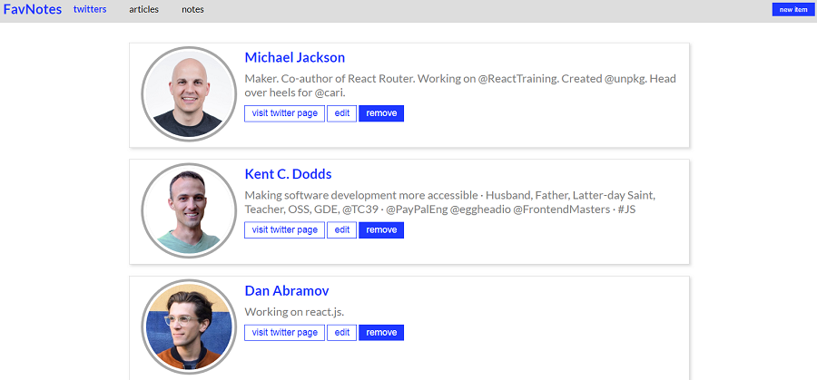

# FavNote WebPage in React

FavNote is a create react app. It was created for desktop and mobiles views. App is using react-router-dom
and components such as BrowserRouter, Link, Route. React-router-dom allows to switch between diffrent views of an app.
It is possible to edit, remove or add new twitters, articles and notes and then display it separatly.

## Tools & Technology used

- Visual Studio Code
- React
- Create-React-App
- React-router-dom
- HTML
- SCSS
- CSS Flexbox
- CSS Grid
- media queries
- Hooks(useState, useEffect)
